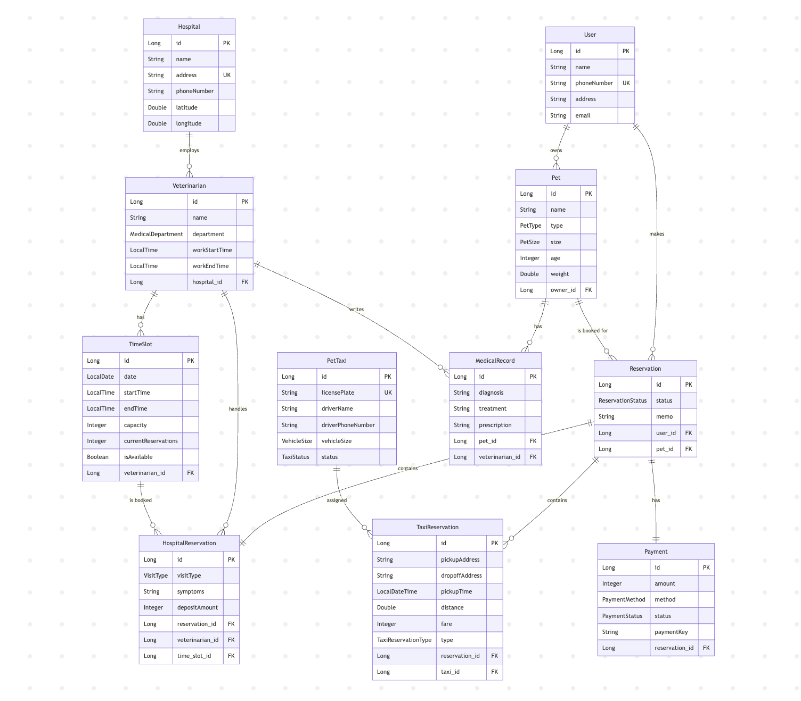

<p align="center">
  
</p>

<h1 align="center">펫모아(PetMoa)</h1>

<p align="center">
  동물병원 예약 + 펫택시 예약을 하나로 통합한 예약 플랫폼
</p>

## 주요 기능

- **통합 예약**: 병원 예약 + 택시 예약을 단일 트랜잭션으로 처리
- **자동 배차**: 반려동물 크기에 맞는 펫택시 자동 배차
- **동시성 제어**: Redis 분산락으로 예약 정원 초과 방지
- **환불 정책**: 24시간 전 100%, 12시간 전 50%, 당일 환불 불가

---

## 기술 스택

| 분류 | 기술 |
|-----|-----|
| Language | Java 17 |
| Framework | Spring Boot 4.0 |
| Database | MySQL 8, Redis 7 |
| ORM | Spring Data JPA, QueryDSL |
| Docs | Swagger (SpringDoc OpenAPI) |
| Build | Gradle |
| Test | JUnit 5, Testcontainers |

---

## 프로젝트 구조

```
src/main/java/PetMoa/PetMoa/
├── domain/
│   ├── user/           # 사용자 도메인
│   ├── pet/            # 반려동물 도메인
│   ├── hospital/       # 병원, 수의사, 타임슬롯
│   ├── taxi/           # 펫택시 도메인
│   ├── reservation/    # 예약 도메인 (핵심)
│   └── payment/        # 결제 도메인
│
└── global/
    ├── config/         # Redis, Swagger, QueryDSL 설정
    ├── exception/      # 예외 처리
    ├── lock/           # 분산락 유틸리티
    └── apiPayload/     # 공통 응답 형식
```

### 레이어 구조

```
Controller → Service → Repository → Entity
     ↓
  Facade (락 적용)
```

---

## ERD

<p align="center">
  
</p>

---

## 실행 방법

### 1. 사전 요구사항

- Java 17+
- MySQL 8
- Redis 7
- Docker (테스트용)

### 2. 데이터베이스 설정

```sql
CREATE DATABASE petmoa;
```

### 3. 환경 설정

`src/main/resources/application.yml` 수정:

```yaml
spring:
  datasource:
    url: jdbc:mysql://localhost:3306/petmoa
    username: root
    password: your_password
  data:
    redis:
      host: localhost
      port: 6379
```

### 4. 실행

```bash
./gradlew bootRun
```

### 5. API 문서 접속

```
http://localhost:8080/swagger-ui.html
```

---

## 테스트

### 전체 테스트

```bash
./gradlew test
```

### 동시성 테스트 (Docker 필요)

```bash
# Docker 실행 후
./gradlew test --tests "*ReservationConcurrencyTest"
```

---

## API 엔드포인트

| 메서드 | 경로 | 설명 |
|-------|-----|-----|
| POST | `/api/v1/reservations` | 통합 예약 생성 |
| GET | `/api/v1/reservations` | 내 예약 목록 조회 |
| GET | `/api/v1/reservations/{id}` | 예약 상세 조회 |
| POST | `/api/v1/reservations/{id}/cancel` | 예약 취소 |
| GET | `/api/v1/hospitals` | 병원 목록 조회 |
| GET | `/api/v1/hospitals/{id}` | 병원 상세 조회 |
| GET | `/api/v1/hospitals/{id}/veterinarians/{vetId}/time-slots` | 예약 가능 시간 조회 |

> 전체 API 스펙은 [docs/api-spec.md](docs/api-spec.md) 참고

